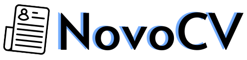

<!-- 

 -->

  

## 📌 About The Project

this project is made to help you make professional resumes using well designed templates , after filling your informations you can download your resume or share it through linkedIn or by QR.

### Built With
* 
* 
* 
* 

## Installation
1. `git clone https://github.com/soumiya59/cv-builder.git`
2. `composer install`
3. `npm install`

## Development

Open your favorite terminal and run these commands. 
- `npm run dev` to run React app
- `php artisan serve` for running Laravel app